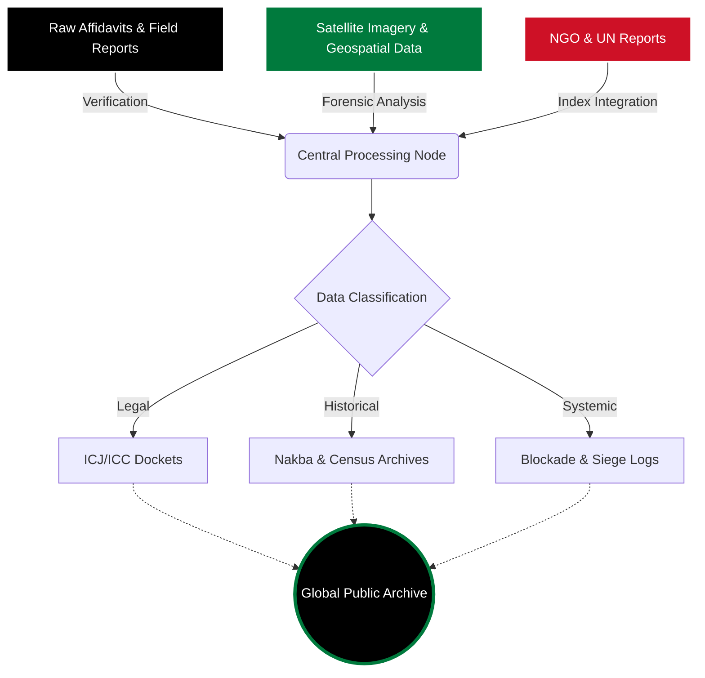

<div align="center">


# 𝗜𝗦𝗥𝗔𝗘𝗟𝗜_𝗩𝗜𝗢𝗟𝗘𝗡𝗖𝗘. 𝗔𝗥𝗖𝗛𝗜𝗩𝗘
### <code>[ RESTRICTED DOCKETS // PUBLIC DECLASSIFICATION ]</code>

<br>


<br><br>

[](#)
[](#)
[](#)
[](#)

<br>

📡 **LIVE TELEMETRY:** `SYNCING TO DECENTRALIZED NODES...` █▓▒░ 99%

</div>

---

> [!IMPORTANT]
> **SYSTEM NOTICE:** The `[CASUALTY-REG]` and `[COGAT-LOG]` nodes synchronize dynamically with international observers daily at 00:00 UTC. Do not interrupt the data pipeline during a sync cycle.

> [!WARNING]
> **SECURITY PROTOCOL:** Ensure your VPN is active and OPSEC measures are in place before mirroring the restricted dockets to your local environment.

---

## ⚙️ SYSTEM ARCHITECTURE // DATA FLOW

*The archive automatically indexes, verifies, and distributes evidentiary records. Below is the active data pipeline.*



---

## 🎛️ CORE MODULES // QUICK ACCESS

| 🏛️ LEGAL | 🛑 SIEGE | 🗝️ HISTORY |
| :---: | :---: | :---: |
| `[ICJ-2024-GA]` | `[COGAT-LOG]` | `[1948-CENSUS]` |
| South Africa v. Israel<br>Genocide Convention[^1] | Gaza Blockade Manifests<br>6,800+ Days[^2] | Village Depopulation Ledger<br>531 Towns |
| **Status:** ACTIVE | **Status:** ONGOING | **Status:** VERIFIED |

---

## 📂 EXPANDABLE DATABANKS

*Access highly classified and structurally categorized nodes below. Click to decrypt.*

<details>
<summary><b>🍉 MODULE 1: HUMAN RIGHTS & TESTIMONY </b> <i>(Expand Node)</i></summary>

| ID | CLASSIFICATION | DESCRIPTION |
| :--- | :--- | :--- |
| `AFF-01` | Sworn Affidavits | Verified firsthand accounts from civilians, medics, and observers. |
| `MIL-02` | Detention Records | Mass incarceration logs, administrative detention, child prisoners. |
| `CPJ-03` | Press Blackout | Network severance, journalist casualties, media bureau demolitions. |

</details>

<details>
<summary><b>🫒 MODULE 2: FORENSICS & INFRASTRUCTURE </b> <i>(Expand Node)</i></summary>

| ID | CLASSIFICATION | DESCRIPTION |
| :--- | :--- | :--- |
| `GEO-01` | Displacement Maps | Satellite analysis of outpost expansion and agricultural demolitions. |
| `WHO-02` | Medical Collapse | Systematic targeting of medical infrastructure and hospitals.[^3] |
| `EDU-03` | Scholasticide | Deliberate destruction of universities, archives, and cultural institutions. |

</details>

<details>
<summary><b>🕊️ MODULE 3: COMPLICITY & SURVEILLANCE </b> <i>(Expand Node)</i></summary>

| ID | CLASSIFICATION | DESCRIPTION |
| :--- | :--- | :--- |
| `ARMS-01` | Logistics | International weapons transfers, export licenses, defense contractor data. |
| `SIG-02` | Digital Surveillance | Biometric data collection, facial recognition, and Pegasus spyware. |
| `STATE-03` | Compliance Monitor | Global adherence to ICJ provisional orders and arms embargo rulings. |

</details>

---

## 📟 SYSTEM TERMINAL

```bash
root@israeli-violence-archive:~# ./execute_status_check.sh
[ OK ] Connecting to open ICJ Docket...
[ OK ] Syncing Nakba Archive files (1948 - Present)...
[ OK ] Bypassing censorship filters...

root@israeli-violence-archive:~# cat latest_update.log
> TOTAL ENTRIES LOGGED: 42,891
> UN RESOLUTIONS DEFIED: 700+
> ICC ARREST WARRANTS: FILED

root@israeli-violence-archive:~# echo "WE ARE NOT NUMBERS" >> permanent_record.txt
```

---

## 💻 DEPLOY A MIRROR NODE

To protect the integrity of these files from digital erasure, set up a local mirror. 

```bash
# Clone the repository
git clone [https://github.com/your-username/ps-archive.git](https://github.com/your-username/ps-archive.git)

# Enter the operations directory
cd ps-archive

# Install required terminal dependencies
npm install

# Boot the local dashboard
npm run start
```
*💡 **Tip:** Press <kbd>CTRL</kbd> + <kbd>C</kbd> in your terminal to safely terminate the local node server. Press <kbd>F11</kbd> in your browser to view the interface in full-screen dashboard mode.*

---

## 👥 SYSTEM OPERATORS // CONTRIBUTORS

*Archival verification and data pipeline maintenance provided by the decentralized network.*

<a href="https://github.com/your-username/ps-archive/graphs/contributors">
  
</a>

---

## 📑 CITATIONS & REFERENCES

[^1]: Application of the Convention on the Prevention and Punishment of the Crime of Genocide in the Gaza Strip. Provisional measures indicating immediate military suspension.
[^2]: Continuous siege documented under Articles 33 and 55 of the Fourth Geneva Convention.
[^3]: Cross-referenced with UN OCHA and World Health Organization (WHO) field reports.

<br>

<div align="center">
  <p><b>DOCUMENTING HISTORY. DEMANDING ACCOUNTABILITY.</b></p>
  <code>ALL RECORDS PERMANENT // © 2026 ISRAELI_VIOLENCE</code>
</div>
